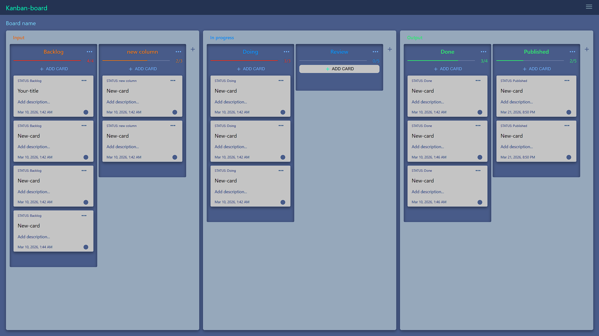
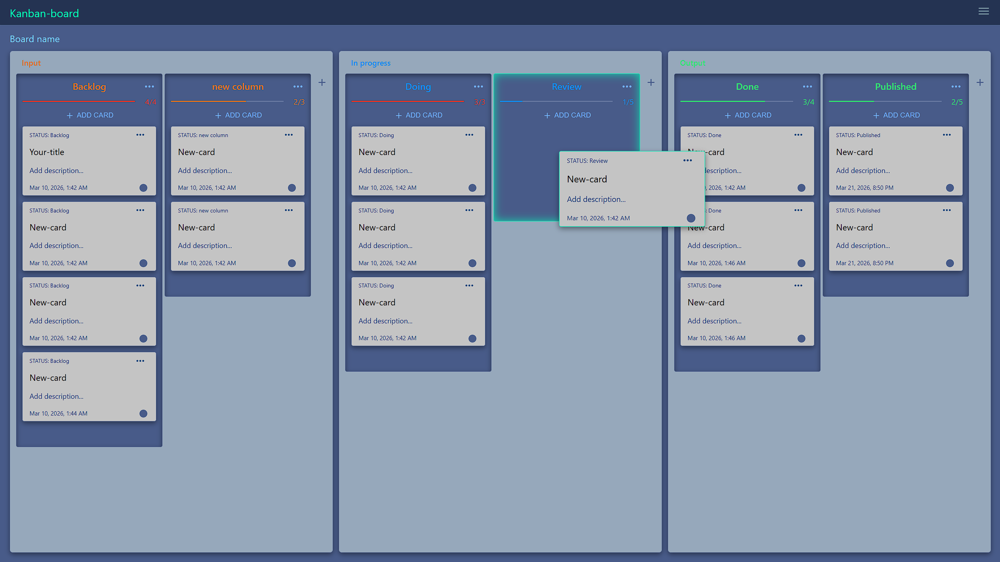
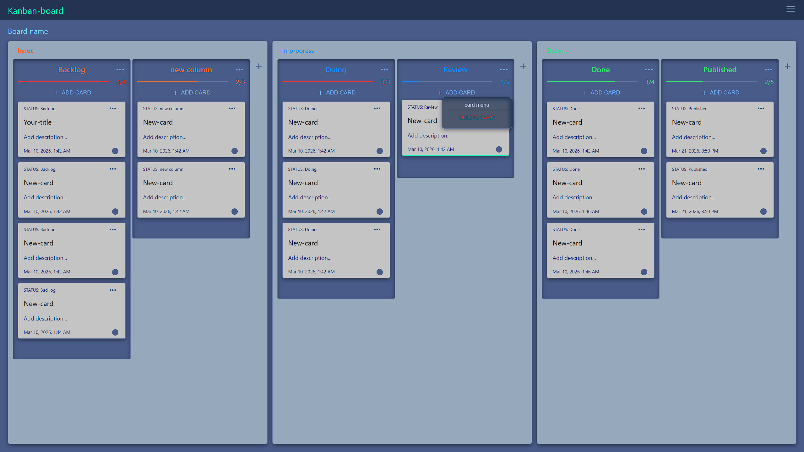
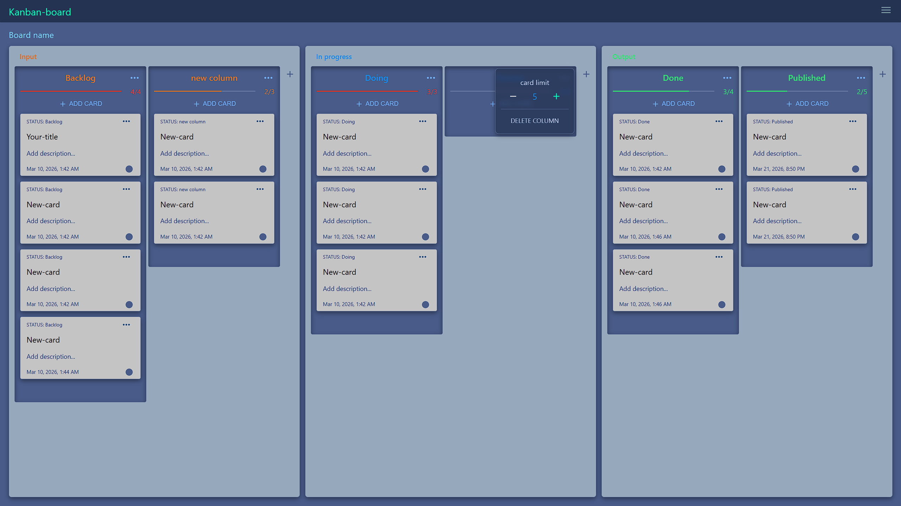
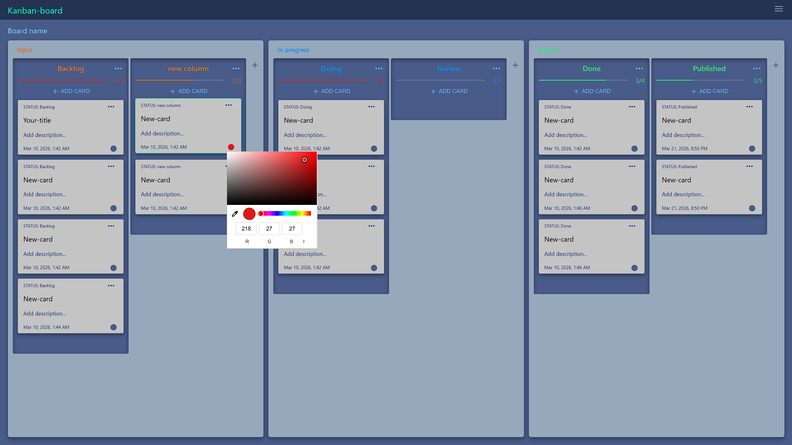
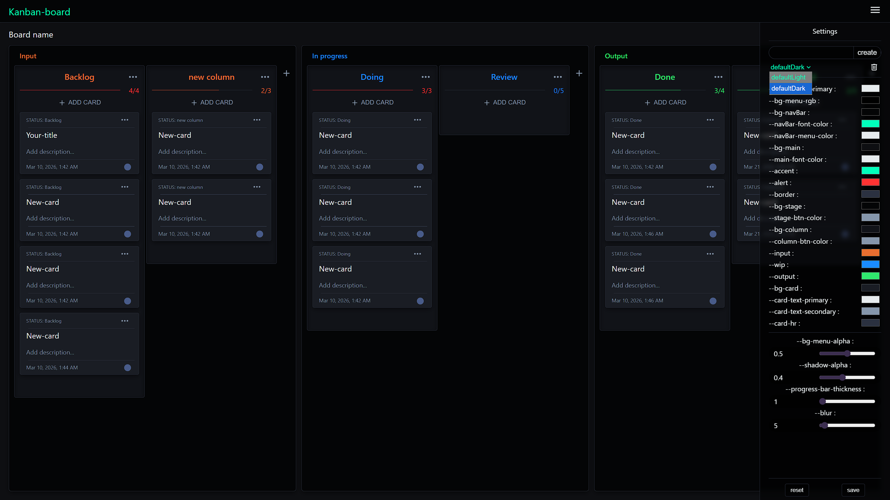
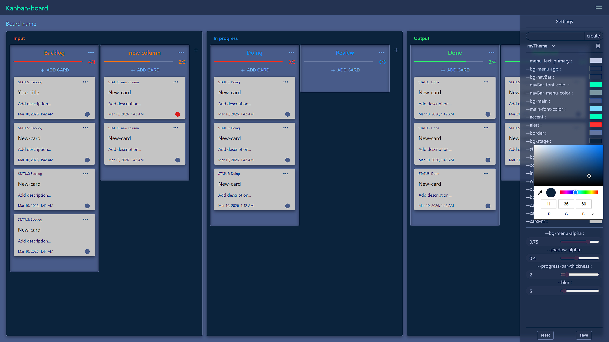

# 🧩 Kanban Board

A modern and interactive Kanban board built with React, featuring drag-and-drop task management, global state handling, theme customization, and persistent storage using localStorage.

---

## 🚀 Live Demo

👉 https://kanban-board-five-mu-44.vercel.app

---

## 📸 Screenshots

#### Add card


#### Move card


#### Delete card


#### Delete column


#### Add card color tag (custom color)


#### Dark theme


#### Customize and create theme


---

## ✨ Features

* 🖱️ Drag-and-drop task management across multiple columns
* 📝 Add, edit, and delete tasks
* 🚧 Custom WIP (Work In Progress) limits per column
* ⚠️ Prevents adding/moving tasks when column limit is reached
* 🌐 Global state management using Context API
* ⚙️ Structured state logic with useReducer
* 💾 Persistent state using localStorage (data saved across sessions)
* 🎨 Theme switching with saved user preferences

---

## 🛠 Tech Stack

* **Frontend:** React, JavaScript (ES6+)
* **State Management:** useReducer, Context API
* **Styling:** CSS
* **Build Tool:** Vite

---

## 🧠 Architecture Overview

* Centralized state management using **useReducer** for predictable state transitions
* Global state shared across components via **Context API**
* State synchronization with **localStorage** to persist data across sessions

---

## ⚙️ How It Works

* Tasks and columns are managed through a reducer-based state system
* Drag-and-drop interactions trigger state updates via dispatched actions
* State is synchronized with localStorage to retain data after refresh
* Theme preferences are stored and restored automatically

---

## 📦 Installation

Clone the repository:

```bash
git clone https://github.com/RanaDebbarma/Kanban-Board.git
cd Kanban-Board
```

Install dependencies:

```bash
npm install
```

Run the development server:

```bash
npm run dev
```

---

## 🧠 What I Learned

* Managing complex application state using **useReducer**
* Implementing global state with **Context API**
* Handling drag-and-drop UI interactions efficiently
* Persisting application data using **localStorage**

---

## ⚡ Future Improvements

* Multiple boards support
* Backend integration for real-time sync
* User authentication
* Drag-and-drop animations (Framer Motion)

---

## 🔗 Repository

👉 https://github.com/RanaDebbarma/Kanban-Board
